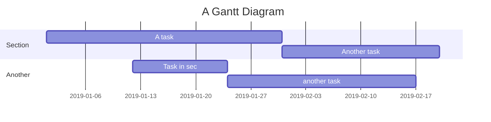

# discourse-mermaid-theme

## Updating Mermaid

This component vendors Mermaid as a static theme asset in `assets/`.

To update Mermaid to the latest published version:

```sh
pnpm update:mermaid
```

To update Mermaid to a specific version:

```sh
pnpm update:mermaid 11.12.2
```

The updater downloads the npm package tarball, verifies the npm-published
integrity hash, extracts `dist/mermaid.min.js`, writes it to
`assets/mermaid-<version>.min.js`, updates `about.json`, and removes older
bundled Mermaid assets.

## Example

````

````
